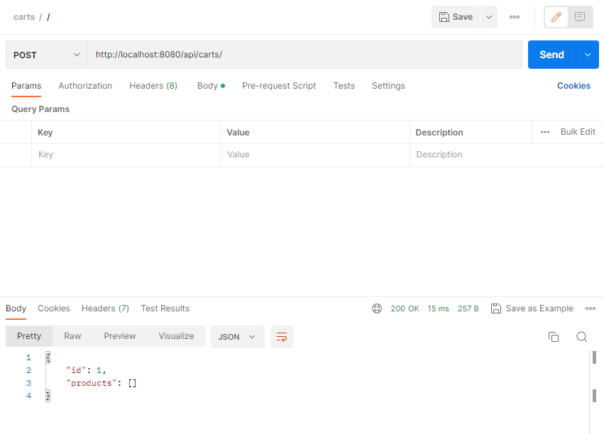
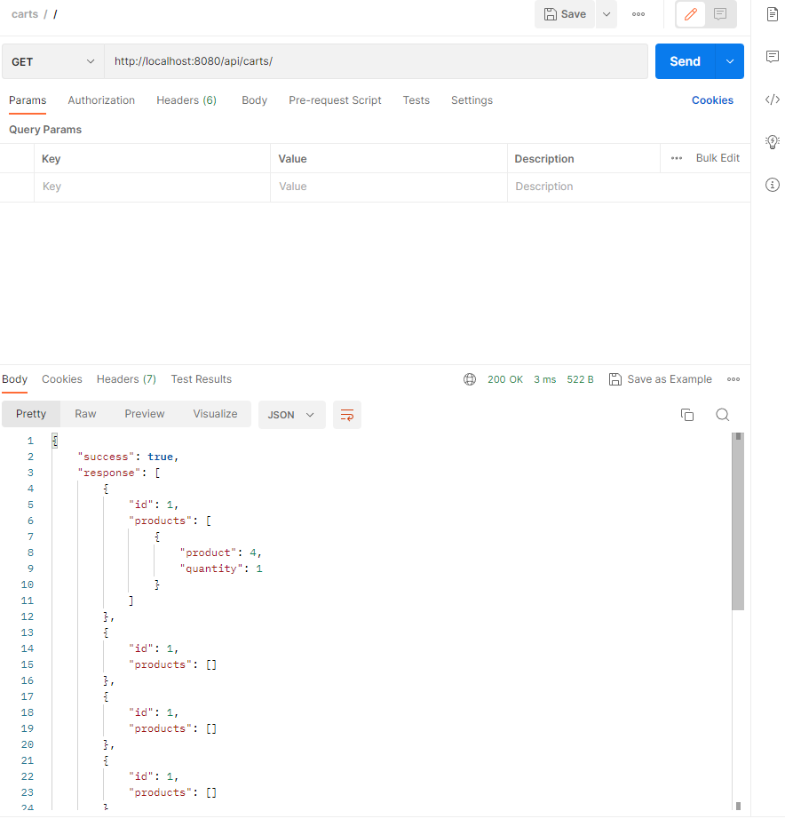
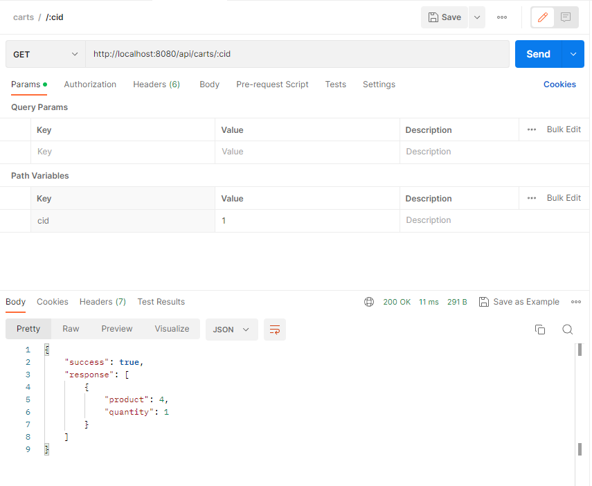
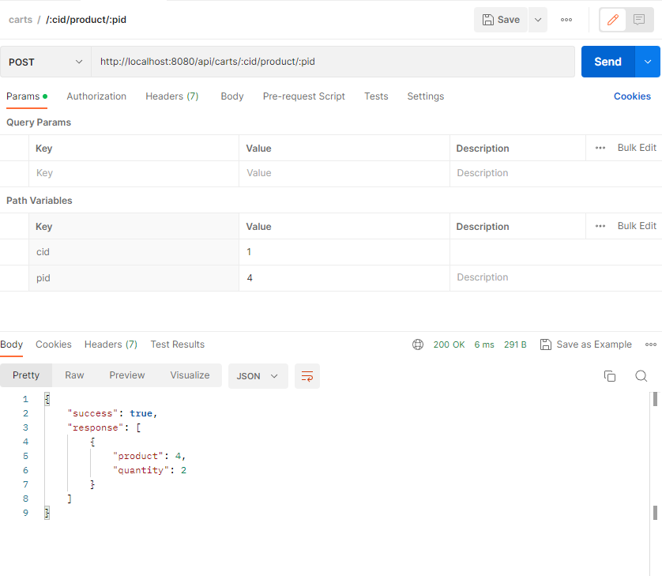
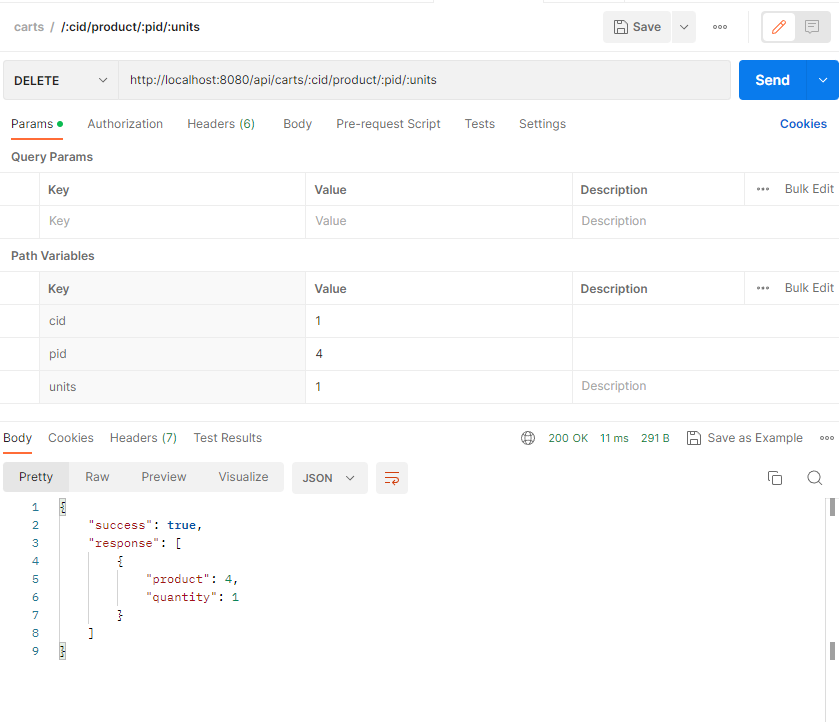
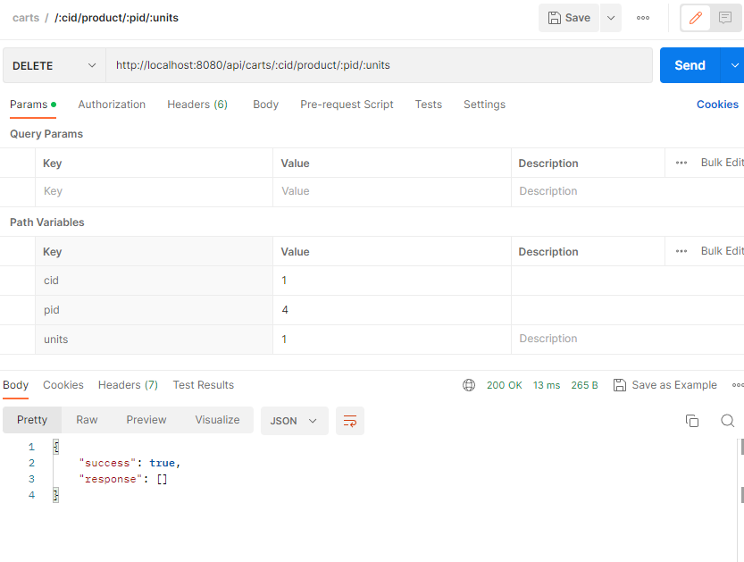

Endpoints de la API
Este código proporciona una API backend con los siguientes endpoints:

1. Crear un Carrito
Endpoint: POST /
Descripción: Crea un nuevo carrito con los productos especificados.
Cuerpo de la solicitud:
products (opcional): Un arreglo de productos que se agregarán al carrito.
Respuesta:
Éxito: Devuelve el objeto del carrito creado.
Fallo: Devuelve un mensaje de error si falla la creación del carrito.
{width=width height=height}
2. Obtener Carritos
Endpoint: GET /
Descripción: Obtiene una lista de carritos.
Parámetros de consulta:
limit (opcional): Especifica el número máximo de carritos a obtener (por defecto, 10).
Respuesta:
Éxito: Devuelve un objeto con la lista de carritos, limitada por el limit especificado.
Fallo: Devuelve un mensaje de error si no se encuentran carritos.
{width=width height=height}
3. Obtener Carrito por ID
Endpoint: GET /:cid
Descripción: Obtiene los productos de un carrito específico basado en el ID del carrito.
Parámetros:
cid: El ID del carrito a recuperar.
Respuesta:
Éxito: Devuelve un objeto con los productos del carrito especificado.
Fallo: Devuelve un mensaje de error si no se encuentra el carrito.
{width=width height=height}
4. Agregar Producto al Carrito
Endpoint: POST /:cid/product/:pid
Descripción: Agrega un producto a un carrito específico.
Parámetros:
cid: El ID del carrito al que se agregará el producto.
pid: El ID del producto a agregar.
Respuesta:
Éxito: Devuelve un objeto con la lista actualizada de productos en el carrito.
Fallo: Devuelve un mensaje de error si no se encuentra el carrito.
{width=width height=height}
5. Eliminar Producto del Carrito
Endpoint: DELETE /:cid/product/:pid/:units
Descripción: Elimina un número especificado de unidades de un producto de un carrito. Si el número de unidades a eliminar excede la cantidad del producto en el carrito, se elimina todo el producto.
Parámetros:
cid: El ID del carrito del que se eliminará el producto.
pid: El ID del producto a eliminar.
units: El número de unidades a eliminar.
Respuesta:
Éxito: Devuelve un objeto con la lista actualizada de productos en el carrito.
Fallo: Devuelve un mensaje de error si no se encuentra el carrito o el producto.
{width=width height=height}
{width=width height=height}